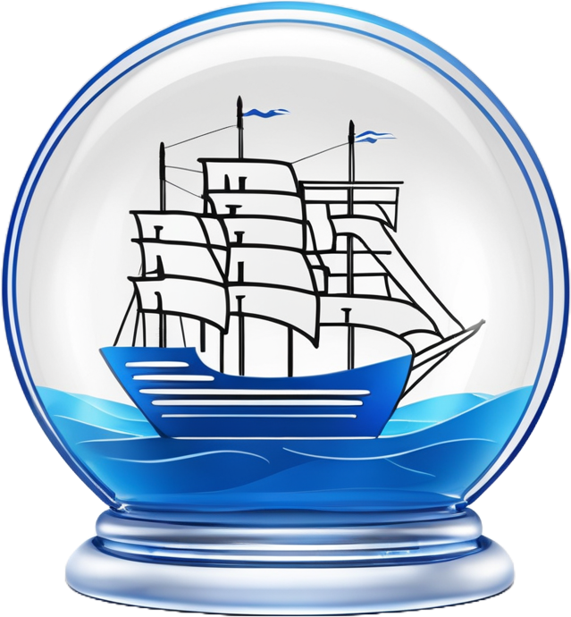

<p align="center">
  
</p>

# KubeSandbox

KubeSandbox is an open-source tool designed to simplify the process of creating and managing a Kubernetes cluster on a
developer's machine. Leveraging Docker, k3d, kubectl, and Helm, this tool provides an easy and quick way to set up a
highly customizable and fully functional Kubernetes cluster for learning, testing, and experimentation.

## Features

- **Single Binary Execution**: Download and execute a single binary file on your terminal to set up your cluster.
- **Sane Default Configuration**: Ideal for beginners who want to learn Kubernetes or for general usage.
- **Customizable Clusters**: Build customized clusters with any ingress controller of your choice through an easy-to-use
  menu.
- **Cluster Management Tools**: Install powerful tools like Rancher and KubeSphere to explore and learn Kubernetes
  visually.
- **Auto Dependency Installation**: Automatically installs any missing dependencies using install scripts (currently
  supported on Ubuntu).
- **Rootless Docker Support**: Supports Docker running in rootless mode with options to update necessary permissions.
- **Future Enhancements**: Plans to include more customization options and auto-installation of common tools.

## Installation

### Compatibility Chart

| Platform               | Auto-dependency Installation Support | Rootless Docker Support | Rootful Docker Support |
|------------------------|--------------------------------------|-------------------------|------------------------|
| Ubuntu                 | :white_check_mark:                   | :white_check_mark:      | :white_check_mark:     
| Windows (WSL - Ubuntu) | :white_check_mark:                   | :white_check_mark:      | :warning: Not tested   |
| Fedora                 | :x: | :white_check_mark: | :white_check_mark:     |
| Manjaro                | :x: | :white_check_mark: | :white_check_mark:     |

### Prerequisites

- Docker
- k3d
- kubectl
- Helm

These dependencies can be automatically installed by the tool on the supported platforms using convenience scripts.

### Windows Installation
1. Install WSL as explained [here](https://learn.microsoft.com/en-us/windows/wsl/install).
2. Install docker desktop from [here](https://www.docker.com/products/docker-desktop/)
3. Open Powershell/Terminal and run command `wsl` to switch to WSL.
4. Continue with the instructions below.

### Download and Execute

1. Go to the [KubeSandbox releases page](https://github.com/NuclearExperiments/KubeSandbox/releases/latest) and download
   the latest binary.
2. Open your terminal and change to the directory where you downloaded the file.
3. Make the binary executable by running:
   ```shell
   chmod +x kubesandbox
   ```
4. Run the binary with:
   ```shell
   ./kubesandbox
   ```

## Usage

Upon execution, the tool provides a menu-driven interface to:

- Create a new Kubernetes cluster with default settings.
- Customize your cluster with various options, including choosing an ingress controller.
- Install Rancher or KubeSphere for enhanced cluster management.
- Update permissions for Docker rootless mode if required.

## Customization Options

KubeSandbox offers extensive customization options to tailor your Kubernetes cluster to your specific needs. These
include:

- Selection of ingress controllers.
- Installation of cluster management tools like Rancher and KubeSphere.
- Configuration options for Docker rootless mode.
- Future updates will include auto-installation of common tools and more customization options.

## Contribution

We welcome contributions from the community! Here are some ways you can contribute:

- Report bugs and request features by opening issues.
- Contribute code by forking the repository and submitting pull requests.
- Help improve the documentation.

## License

This project is licensed under the MIT License. See the [LICENSE](LICENSE) file for more details.

---

Thank you for using KubeSandbox! We hope it helps you learn, test, and experiment with Kubernetes easily and
effectively.